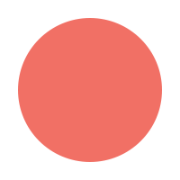

# iMage 

Multiplatform image renderer for MacOS and iOS.

Inspired by [EricaSadun](https://ericasadun.com) and UIGraphicsImageRenderer

## Usage

For the best experience use it with [Pallete](https://github.com/MakeupStudio/Palette)

```swift
import iMage
import Palette
```

```swift
let redCirlce = IMage.render(in: someview.bounds) { let ctx = $0.cgContext 
    let ctx = $0.cgContext!
    ctx.setFillColor(.init(.white))
    ctx.fill(rect)
    ctx.addEllipse(in: rect.insetBy(dx: 10, dy: 10))
    ctx.setFillColor(.init(Color<RGB>.red.with(alpha: 0.7)))
    ctx.fillPath()
}
```

## Installation

Add the package to Your SwiftPM package dependencies:

```swift
.package(url: "https://github.com/makeupstudio/iMage.git", from: "1.0.0")
```

then add `iMage` dependency to your target.

## Examples

<p align="center">
  
  
  
</p>


